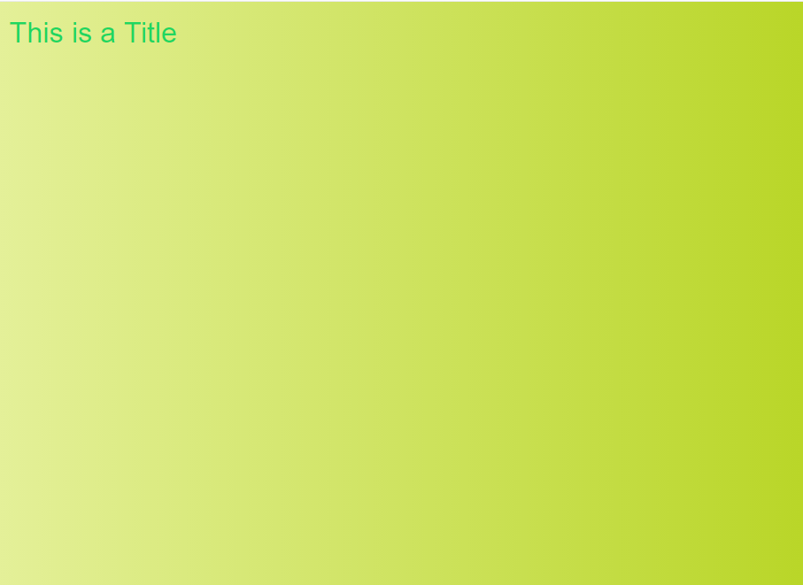
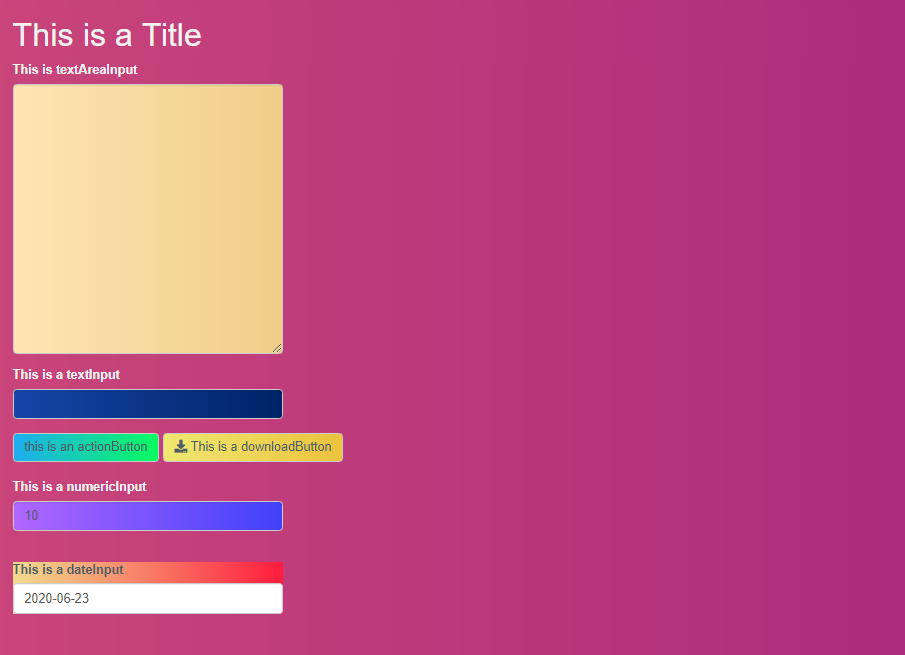
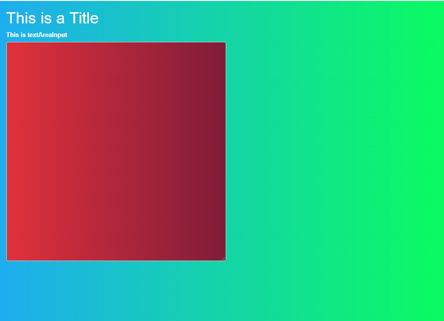

<!-- README.md is generated from README.Rmd. Please edit that file -->

# corazon

`corazon` allows you to incorporate easily
[colorffy](https://www.colorffy.com/gradients/catalog) gradient colors
within Shiny elements.


## Installation

You can install the development version of `corazon` from Github with:

``` r

install.packages("remotes")  # If not installed 

remotes::install_github("feddelegrand7/corazon")
```

## Examples

# IMPORTANT: The gradients won’t be applied if you leave your shiny application empty \!\!\!

By default `corazon` applies the color gradient on the body of your
shiny app:

``` r
library(shiny)
library(corazon)

ui <- fluidPage(

corazon_gradient(colorName = "PINEAPPLE", txtColor = "#1ED760"),

h1("This is a Title"),

)

server <- function(input, output) {}

shinyApp(ui = ui, server = server)
```



How do you find the gradient colors’ names ?

  - You can run `available_gradients()`: this will return a data frame
    of the available gradient colors’ names along with their respective
    hex codes.

  - You can visit the
    [colorffy](https://www.colorffy.com/gradients/catalog) website where
    you can find a catalog of the gradient colors. Just copy the names
    and paste them within the `corazon_gradient()` function.

You can incorporate gradients within any shiny element. You just need to
prefix the shiny element’s Id with a `#`

``` r
library(shiny)
library(corazon)

ui <- fluidPage(

corazon_gradient(element = "#txt", colorName = "PEACH", txtColor = "#4E5C68"), # don't forget to prefix the id wih the # 

h1("This is a Title"),

textAreaInput(inputId = "txt", label = "This is textAreaInput ", height = "500px", width = "500px")


)

server <- function(input, output) {}

shinyApp(ui = ui, server = server)
```



Finally, you can apply different gradients to different shiny elements:

``` r
library(shiny)
library(corazon)

ui <- fluidPage(

corazon_gradient(colorName = "COOL", txtColor = "white"),  
corazon_gradient(element = "#txt", colorName = "SANGRIA WINE", txtColor = "#4E5C68"),  

h1("This is a Title"),

textAreaInput(inputId = "txt", label = "This is textAreaInput ", height = "500px", width = "500px")


)

server <- function(input, output) {}

shinyApp(ui = ui, server = server)
```



## Code of Conduct

Please note that the `corazon` project is released with a [Contributor
Code of
Conduct](https://contributor-covenant.org/version/2/0/CODE_OF_CONDUCT.html)
and made with ❤️. By contributing to this project, you agree to abide by
its terms.
